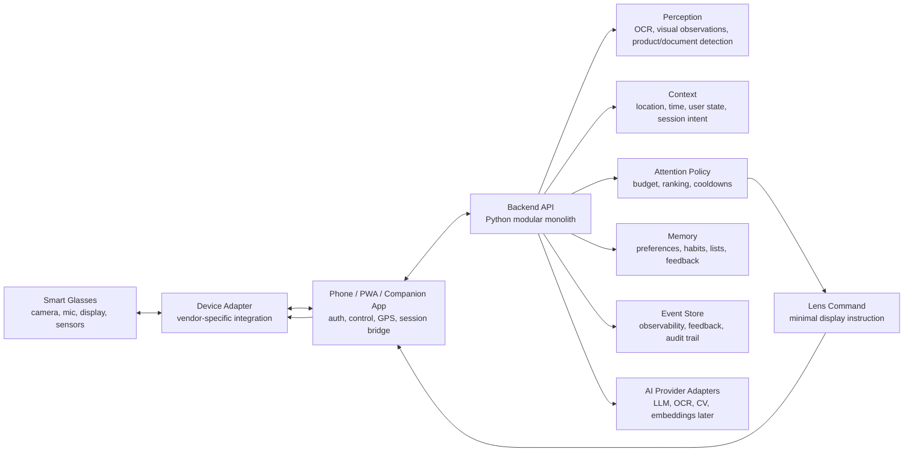

# New Era Glasses

New Era Glasses is a contextual intelligence platform for smart glasses.

The product vision is simple:

> The glasses that remember, read, and alert for you.

New Era treats smart glasses as a lightweight sensor and display surface. The durable product asset is the intelligence layer that understands context, respects attention, learns from feedback, and decides what deserves to appear in the user's field of view.

## Product Thesis

Smart glasses should not behave like a phone screen attached to the user's face. They should behave like a selective assistant:

```text
observe -> understand -> contextualize -> decide -> display -> learn
```

The first product direction focuses on three practical flows:

- Grocery and memory assistant.
- Anti-trap document and contract reader.
- UV/protector and preventive reminders.

Future modules may include environment radar, accessibility, color assistance, AR measurements, and richer personal memory.

## Architecture

New Era starts as a modular, observable, privacy-aware intelligence platform:



Runtime responsibilities:

- **Smart glasses:** capture input and display minimal commands.
- **Phone/PWA/companion:** authenticate, configure, bridge sessions, simulate the lens, and provide user control.
- **Python backend:** own the intelligence, memory, AI orchestration, event schema, and attention policy.

The backend should begin as a Python modular monolith using Clean Architecture and DDD boundaries. Microservices are intentionally out of scope until domain boundaries and scaling profiles are proven.

## MVP Scope

In scope:

- PWA/app experience for settings, lists, contract upload/analysis, UV reminders, and simulated lens.
- Backend Python with Clean Architecture and DDD.
- Event Schema v1.
- Attention Policy v1 with attention budget.
- Grocery list and simple product/item recognition flow.
- Anti-trap document/contract analysis flow.
- UV/protector reminder flow.
- Browser/mobile camera simulation before deep hardware integration.
- Device adapter abstraction for future smart-glasses platforms.

Out of scope:

- Custom glasses hardware.
- Heavy RAG or vector memory as a required MVP dependency.
- Real-time physical safety alerts that require sub-100ms guarantees.
- Real-time price comparison and live store inventory.
- Full visual accessibility suite.
- Always-on camera recording.
- Vendor-specific product assumptions inside domain logic.

## Core Design Decisions

- **Device adapters first:** the core must not depend directly on Meta, Ray-Ban, Android XR, Xreal, or any future vendor.
- **Attention Policy is central:** every alert candidate must pass through a central policy before being shown.
- **Event Schema from day one:** every important observation, candidate, decision, display, dismissal, and feedback event should be observable.
- **RAG ready, not RAG heavy:** retrieval interfaces should exist early, while vector search and semantic memory can arrive later.
- **Privacy as UX:** memory must be explicit, inspectable, and deletable; sensitive data must not leak into generic event metadata.
- **Lens commands, not UI coupling:** backend responses should be device-neutral commands that PWA, app, or glasses adapters can render.
- **Spec-driven development:** important features must start from specs, contracts, acceptance criteria, security rules, and performance budgets.

## Spec-Driven Development

New Era uses Spec-Driven Development (SDD) to keep product behavior, architecture, AI prompts, security, and performance aligned before implementation.

The delivery loop is:

```text
problem -> spec -> design -> tasks -> implementation -> tests -> telemetry
```

Each serious capability should define:

- objective and non-goals
- functional requirements
- data/privacy classification
- security controls
- performance budget
- events and observability
- failure modes
- acceptance criteria
- test/eval plan

Start here:

- [docs/specs/README.md](docs/specs/README.md)
- [docs/specs/0001-platform-foundation.md](docs/specs/0001-platform-foundation.md)
- [docs/specs/0002-pwa-shell.md](docs/specs/0002-pwa-shell.md)

## Repository Map

```text
src/
  new_era/
    domain/
    application/
    infrastructure/
tests/
  unit/
docs/
  architecture/
    ai-prompt-contracts.md
    overview.md
    performance-latency.md
    pwa-frontend.md
    security-implementation.md
  specs/
    README.md
    spec-template.md
    0001-platform-foundation.md
    0002-pwa-shell.md
```

Main documents:

- [docs/architecture/overview.md](docs/architecture/overview.md)
- [docs/architecture/performance-latency.md](docs/architecture/performance-latency.md)
- [docs/architecture/pwa-frontend.md](docs/architecture/pwa-frontend.md)
- [docs/architecture/device-adapters.md](docs/architecture/device-adapters.md)
- [docs/architecture/security-implementation.md](docs/architecture/security-implementation.md)
- [docs/architecture/ai-prompt-contracts.md](docs/architecture/ai-prompt-contracts.md)

## Development

The first executable foundation lives in `src/new_era`.

It includes:

- observation contracts for simulated input
- domain contracts for attention, events, lens commands, and device capabilities
- job contracts for long-running document analysis
- an `AttentionPolicy` v1 with deterministic budget rules
- a simple observation interpreter that turns simulated grocery observations into `AlertCandidate`
- `GrocerySessionService` and `DocumentSessionService` as the first MVP-facing application entry points
- a shared `SimulationRuntime` that keeps session state readable across requests, with optional SQLite persistence via `NEW_ERA_SQLITE_PATH`
- a real OCR adapter for image-based contract extraction
- deterministic contract parsing with excerpt extraction, structured findings, and refined alert language
- an `EvaluateAlertCandidate` use case
- a `DeviceGateway` port and `DeliverLensCommand` use case
- a `ProcessAlertCandidate` orchestrator for the first end-to-end alert flow
- a `ProcessObservation` orchestrator for the first observation-to-display flow
- a `GetSessionTrace` read model use case for session history with user/module/event/step filters and cursor pagination
- user-owned session records with create/list/read flows for the companion app
- an `EnqueueDocumentAnalysisJob` use case, `RunDocumentAnalysisJob` runner, and job status/result lookup for async document flows
- a threaded in-memory document analysis worker with retries, timeout policy, and persisted analysis results
- a FastAPI adapter that exposes the grocery simulation flow over HTTP
- a `BrowserSimulationAdapter` for PWA/app simulation before hardware integration
- an `HttpDeviceBridgeAdapter` for real native/hardware bridge delivery over HTTP
- a camera bridge endpoint that runs real image input through the document OCR flow
- in-memory event, job, job payload, and document analysis store adapters for tests and simulation
- SQLite event and session store adapters for durable MVP session history
- unit tests for policy, event redaction, observation mapping, lens command generation, device delivery, and alert processing

Run the tests:

```powershell
$env:PYTHONPATH='src'; python -m unittest discover
```

Run the HTTP adapter:

```powershell
$env:PYTHONPATH='src'; python -m uvicorn new_era.infrastructure.http.app:create_app --factory --reload
```

Run with persistent session/history storage:

```powershell
$env:PYTHONPATH='src'; $env:NEW_ERA_SQLITE_PATH='.new_era/runtime.sqlite3'; python -m uvicorn new_era.infrastructure.http.app:create_app --factory --reload
```

Initial endpoints:

- `GET /`
- `GET /health`
- `POST /api/users/{user_id}/sessions`
- `GET /api/users/{user_id}/sessions`
- `POST /api/simulations/grocery/missing-item`
- `POST /api/simulations/documents/contract-review`
- `GET /api/device/capabilities`
- `POST /api/device-bridge/camera/document-contract-review`
- `GET /api/sessions/{session_id}/trace`
- `GET /api/users/{user_id}/sessions/{session_id}/trace`
- `POST /api/jobs/documents/contract-analysis`
- `GET /api/jobs/{job_id}`
- `GET /api/jobs/{job_id}/result`
- `POST /api/jobs/{job_id}/status`

Recommended next documentation:

- `docs/product/vision.md`
- `docs/product/mvp.md`
- `docs/architecture/event-schema.md`
- `docs/architecture/attention-policy.md`
- `docs/architecture/device-adapters.md`
- `docs/adr/0001-use-existing-smart-glasses-before-custom-hardware.md`

## Validation Plan

1. Product simulation
   - PWA simulates lens alerts.
   - User creates shopping lists.
   - User uploads/scans documents.
   - Backend records the event flow.

2. Phone camera prototype
   - Phone camera acts as glasses input.
   - Backend processes selected observations.
   - PWA displays simulated lens output.
   - `POST /api/device-bridge/camera/document-contract-review` supports real camera image input for the document flow.

3. Device adapter prototype
   - Integrate one real smart-glasses platform when available.
   - Keep backend/domain contracts unchanged.
   - Replace only adapter and display delivery.
   - Set `NEW_ERA_DEVICE_BRIDGE_URL` to route lens commands to a real HTTP bridge.

## Current Status

This repository is in the architecture and MVP foundation phase.

The current runtime foundation implements the core contracts from `SPEC-0001` without tying the product to a web framework, database, AI provider, or glasses vendor.
