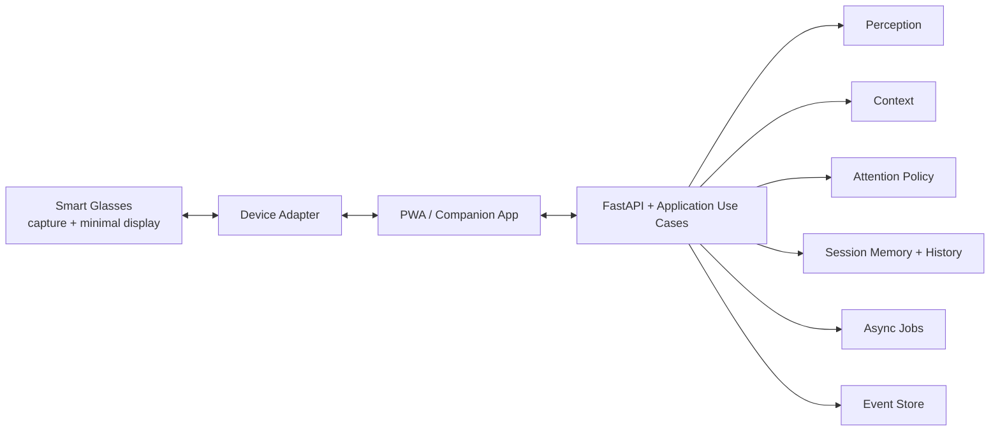

# New Era Glasses

New Era Glasses is a contextual intelligence platform for smart glasses.

The product thesis remains:

> The glasses that remember, read, and alert for you.

The glasses are the capture and display edge. The durable asset is the backend intelligence layer that understands context, protects attention, and decides when a minimal response should return to the user.

## Current Product State

The repository is past the blank-foundation phase. Today it already includes:

- a Python modular monolith under `src/new_era`
- a FastAPI companion surface with a real PWA shell
- a backend-managed auth session cookie for the browser companion
- grocery simulation and session tracing
- async document analysis jobs with local artifact lifecycle
- SQLite-backed persistence for local-first sessions and history
- SQLite-backed persistence for local auth sessions when enabled in the runtime
- a browser simulation device adapter and an HTTP device bridge adapter
- document feedback metrics, policy rejections, quotas, and retention expiration

What is still not finished:

- production-grade authentication UX, provider integration, and browser hardening
- UV reminder module implementation
- browser-level end-to-end PWA coverage
- real hardware integration beyond the HTTP bridge contract
- LLM-backed document analysis and formal prompt versioning in production

## Product Loop

```text
observe -> understand -> contextualize -> decide -> display -> learn
```

## Architecture Snapshot



Current architectural stance:

- modular monolith
- Clean Architecture boundaries
- device-neutral lens commands
- async jobs for expensive document work
- privacy-aware local storage
- event-driven observability inside the monolith

## Repository Map

```text
src/
  new_era/
    domain/
    application/
    infrastructure/
tests/
  unit/
docs/
  architecture/
  specs/
evals/
  document_analysis/
```

## Documentation Map

These are the docs that should be treated as current:

### Architecture

- [docs/architecture/overview.md](docs/architecture/overview.md)  
  Source of truth for current runtime shape and major boundaries.
- [docs/architecture/auth-boundary.md](docs/architecture/auth-boundary.md)  
  Identity boundary, current-user contract, ownership rules, and MVP auth decision.
- [docs/architecture/pwa-frontend.md](docs/architecture/pwa-frontend.md)  
  Current PWA scope, offline posture, and frontend gaps.
- [docs/architecture/security-implementation.md](docs/architecture/security-implementation.md)  
  Current security/privacy controls and missing production controls.
- [docs/architecture/device-adapters.md](docs/architecture/device-adapters.md)  
  Browser simulation and HTTP bridge strategy.
- [docs/architecture/performance-latency.md](docs/architecture/performance-latency.md)  
  Latency classes, async boundaries, and current performance posture.
- [docs/architecture/ai-prompt-contracts.md](docs/architecture/ai-prompt-contracts.md)  
  Current deterministic/OCR analysis posture and future prompt-contract shape.

### Specs

- [docs/specs/README.md](docs/specs/README.md)  
  Index of active specs and their status.
- [docs/specs/0001-platform-foundation.md](docs/specs/0001-platform-foundation.md)  
  Platform foundation. Partially implemented, still the base contract.
- [docs/specs/0002-pwa-shell.md](docs/specs/0002-pwa-shell.md)  
  PWA shell. Mostly implemented.
- [docs/specs/0003-document-mvp-hardening.md](docs/specs/0003-document-mvp-hardening.md)  
  Document hardening. In progress, with completed and remaining items called out.
- [docs/specs/0004-auth-boundary.md](docs/specs/0004-auth-boundary.md)  
  Planned auth boundary implementation for the companion surface.

### Evals

- [evals/document_analysis/README.md](evals/document_analysis/README.md)  
  How to run the local OCR/deterministic analysis eval harness.

## Development

Run tests:

```powershell
$env:PYTHONPATH='src'; python -m pytest
```

Run the app:

```powershell
$env:PYTHONPATH='src'; python -m uvicorn new_era.infrastructure.http.app:create_app --factory --reload
```

Enable the explicit development auth fallback:

```powershell
$env:PYTHONPATH='src'
$env:NEW_ERA_ENABLE_DEV_AUTH='1'
python -m uvicorn new_era.infrastructure.http.app:create_app --factory --reload
```

Run with SQLite persistence:

```powershell
$env:PYTHONPATH='src'
$env:NEW_ERA_SQLITE_PATH='.new_era/runtime.sqlite3'
python -m uvicorn new_era.infrastructure.http.app:create_app --factory --reload
```

Run the local document eval harness:

```powershell
$env:PYTHONPATH='src'; python .\tools\evaluate_document_analysis.py
```

## Current Validation Baseline

The maintained baseline is the code plus the unit suite:

```powershell
$env:PYTHONPATH='src'; python -m pytest
```

The suite currently covers:

- attention policy behavior
- event redaction and event persistence
- document jobs, idempotency, quotas, retention, and result lookup
- SQLite-backed session, job, event, and analysis stores
- PWA HTTP routes and static assets
- browser simulation and HTTP device bridge adapters

## What Changed Recently

The latest completed hardening pass delivered:

- consistent `PolicyRejection` contracts
- session-level upload and active-job quotas
- `blocked_reason` read model support in `/jobs`
- payload fingerprint idempotency checks
- post-terminal artifact retention expiration
- PWA handling for friendly blocking messages and read-only offline shell
- backend-managed auth session bootstrap via `/api/auth/session`, login, and logout
- local password login for the companion through `NEW_ERA_LOCAL_AUTH_USER_ID` and `NEW_ERA_LOCAL_AUTH_PASSWORD`
- dev header auth moved behind an explicit `NEW_ERA_ENABLE_DEV_AUTH` gate
- same-origin validation for cookie-authenticated writes
- `current-user` session routes so the browser no longer needs `user_id` in companion URLs

The next meaningful work is not more plumbing. It is finishing product-grade behavior around auth, browser E2E coverage, and the remaining modules.
