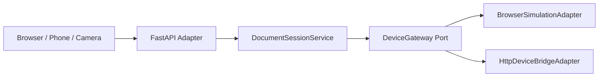

# Device Adapter Architecture

Status: Active reference  
Last updated: 2026-05-25

## Purpose

Describe how New Era keeps device integration replaceable while the backend remains the authority for intelligence and policy.

## Current Strategy

New Era does not embed device-vendor behavior into the core. The backend emits device-neutral `LensCommand` objects, and adapters translate them to a browser preview or a bridge process.

## Implemented Adapters

### BrowserSimulationAdapter

Used for:

- PWA lens preview
- tests
- local simulation without glasses hardware

### HttpDeviceBridgeAdapter

Used for:

- forwarding `LensCommand` payloads to an external bridge
- local native/hardware experimentation without changing domain logic

## Implemented Input Bridge

Today the repo also supports a camera bridge endpoint:

- `POST /api/device-bridge/camera/document-contract-review`

That path lets a real image payload enter the existing document pipeline through the HTTP surface.

## Current Runtime Shape



## What Progressed

Already real in the codebase:

- adapter abstraction exists
- browser simulation path works
- external HTTP bridge delivery works
- capability checks and delivery failure events exist

## What Is Still Missing

Not implemented yet:

- vendor-specific glasses SDK adapter
- gesture/voice-specific interaction adapters
- device pairing lifecycle
- production-grade bridge auth and trust model

## Contract Boundary

The backend should continue to treat device output like this:

```text
decide -> produce LensCommand -> deliver through DeviceGateway
```

It should not learn vendor payload formats, native lifecycle rules, or transport details.

## Keep / Avoid

Keep:

- device-neutral commands
- adapter-owned transport logic
- capability discovery outside the domain

Avoid:

- vendor conditionals in domain logic
- client/device-generated policy decisions
- coupling the PWA preview format to one hardware vendor
