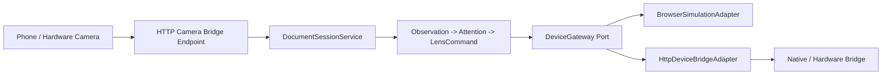

# Device Adapter Architecture

Status: Draft v1  
Date: 2026-05-24  
Related runtime:
[../../src/new_era/application/ports/device_gateway.py](../../src/new_era/application/ports/device_gateway.py),
[../../src/new_era/infrastructure/device/http_device_bridge_adapter.py](../../src/new_era/infrastructure/device/http_device_bridge_adapter.py),
[../../src/new_era/infrastructure/http/app.py](../../src/new_era/infrastructure/http/app.py)

## 1. Purpose

New Era treats glasses, phones, PWAs, and native companions as replaceable device
surfaces. The backend owns intelligence, attention, and lens commands. Device
adapters only translate between New Era contracts and a concrete capture/display
surface.

This keeps the product useful in simulation while allowing a real phone camera or
hardware bridge to be attached without changing domain logic.

## 2. Current Runtime Shape



Implemented adapters:

- `BrowserSimulationAdapter`: stores delivered commands in memory for PWA and tests.
- `HttpDeviceBridgeAdapter`: posts device-neutral `LensCommand` payloads to a real
  HTTP bridge, such as a native app, local hardware daemon, or vendor wrapper.

Implemented input bridge:

- `POST /api/device-bridge/camera/document-contract-review`: accepts a real camera
  image payload, runs OCR, persists the analysis record, and feeds the existing
  document observation pipeline.

## 3. Contracts

Outbound display uses the application port:

```text
DeviceGateway.capabilities() -> DeviceCapabilities
DeviceGateway.deliver(LensCommand) -> None
```

The domain remains vendor-neutral:

- `DeviceCapabilities` reports camera/display/voice/gesture support.
- `LensCommand` is the only display instruction emitted by the backend.
- Vendor SDKs, native bridge lifecycle, and hardware permissions stay in
  infrastructure.

The real bridge adapter expects:

```text
GET  {bridge_url}/capabilities
POST {bridge_url}/lens-commands
```

The command delivery payload is:

```json
{
  "command": {
    "command_id": "cmd_...",
    "command_version": 1,
    "command_type": "show_alert",
    "priority": "high",
    "title": "Contract clause needs attention",
    "body": "Check the automatic renewal clause.",
    "duration_ms": 7000,
    "interaction": {
      "can_dismiss": true,
      "can_mark_useful": true
    },
    "metadata": {}
  }
}
```

## 4. Configuration

Default runtime remains simulation:

```powershell
$env:PYTHONPATH='src'; python -m uvicorn new_era.infrastructure.http.app:create_app --factory --reload
```

Real bridge delivery is enabled by environment:

```powershell
$env:PYTHONPATH='src'
$env:NEW_ERA_DEVICE_BRIDGE_URL='http://127.0.0.1:8787'
$env:NEW_ERA_DEVICE_BRIDGE_TOKEN='dev-bridge-token'
python -m uvicorn new_era.infrastructure.http.app:create_app --factory --reload
```

Optional:

```powershell
$env:NEW_ERA_DEVICE_BRIDGE_TIMEOUT_SECONDS='2.0'
```

## 5. Failure Behavior

Display delivery is best-effort at this layer:

- unsupported display records `device_capability_missing`
- bridge delivery failure records `device_delivery_failed`
- successful delivery records `lens_command_delivered`

The event metadata must not include access tokens, raw camera frames, raw document
text, or full OCR text.

## 6. Validation

Runtime tests cover:

- browser simulation capabilities and command storage
- real HTTP bridge capability reads
- real HTTP bridge command POST delivery
- bridge failure converted to `device_delivery_failed`
- camera bridge endpoint using an actual image payload through OCR

Manual validation path:

1. Start a local bridge that implements `/capabilities` and `/lens-commands`.
2. Run the API with `NEW_ERA_DEVICE_BRIDGE_URL`.
3. Submit `POST /api/device-bridge/camera/document-contract-review` with a camera
   image.
4. Confirm the session trace contains observation, candidate, decision, and
   delivery events.
5. Confirm the local bridge received the `LensCommand` JSON.
