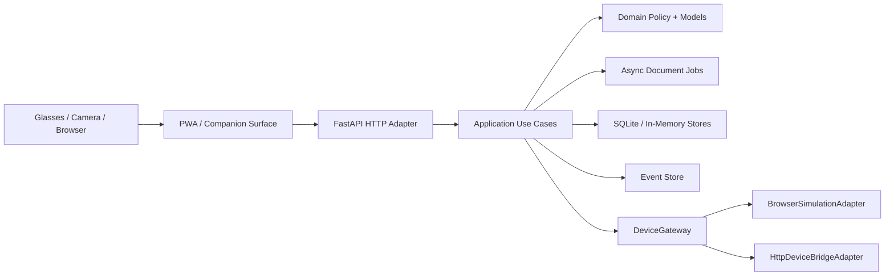

# New Era Glasses Architecture Overview

Status: Active reference  
Last updated: 2026-05-25  
Owner: New Era product/engineering

## Purpose

This document is the architecture source of truth for the current repository state.

It intentionally favors runtime truth over earlier planning language. When code and older docs diverge, the code under `src/` and tests under `tests/` win.

## Product Model

New Era treats glasses as a lightweight capture and display surface. The backend owns interpretation, policy, session protection, and the decision to show or suppress.

The operating loop is:

```text
observe -> understand -> contextualize -> decide -> display -> learn
```

The working mental model for the current stack is:

```text
Contextual Attention Pyramid

raw signal rises
session boundary protects it
policy decides
only a minimal safe response returns
```

## Current Runtime Shape



## What Exists Today

Implemented and exercised in tests:

- browser-served PWA shell
- backend-managed auth session cookie plus `/api/auth/session`, local-password login, and logout
- same-origin validation for cookie-authenticated writes
- grocery simulation flow
- document upload and async document analysis jobs
- local document artifact lifecycle with delete and expiration
- session trace and jobs read models
- user-owned session records
- feedback capture and feedback metrics
- in-memory runtime plus SQLite persistence
- SQLite-backed local auth session persistence when the runtime uses a database path
- browser simulation device delivery
- HTTP device bridge delivery
- local OCR plus deterministic document analysis
- explicit development-only header auth fallback behind configuration
- `current-user` companion routes for sessions, trace, jobs, and feedback metrics

## What Is Still Missing

Not implemented yet, or only partially implemented:

- production-grade auth hardening, provider-backed identity, and broader browser security posture
- UV reminder module behavior
- richer product memory and retrieval layers
- browser-level end-to-end validation
- production queue, worker, and operational monitoring stack
- native glasses adapter beyond the generic HTTP bridge
- LLM-backed document reasoning as a production contract

## Architectural Boundaries

### Domain

The domain layer owns:

- observations
- alert candidates
- attention decisions
- lens commands
- document analysis models
- events and redaction rules
- jobs and job status models

The domain must remain free of framework and vendor dependencies.

### Application

The application layer owns:

- orchestration use cases
- policy enforcement
- idempotency rules
- document retention behavior
- read models
- job lifecycle transitions

This is where the session protection boundary lives today: quotas, `PolicyRejection`, ownership checks, and retention rules are enforced here or immediately around it.

### Infrastructure

Infrastructure owns:

- FastAPI endpoints
- PWA static assets
- SQLite stores
- filesystem artifact storage
- OCR and device adapters
- in-memory simulation adapters

## Persistence Model

Current persistence modes:

- in-memory for tests and quick local simulation
- SQLite for durable local-first sessions, jobs, analyses, artifacts, and events

This repo is not using PostgreSQL yet. Older docs that assumed PostgreSQL as the early runtime should be read as future direction, not current fact.

## Async Boundary

The important async boundary already exists:

```text
upload/text input -> enqueue job -> poll/read status -> read result
```

Document analysis is intentionally not part of the fast synchronous attention path.

Current job hardening already includes:

- per-session active job quota
- payload fingerprint idempotency
- retry and timeout behavior
- manual and worker terminal transitions
- post-terminal artifact expiration

## Current Quality Posture

Strong today:

- architectural boundaries are real, not performative
- tests cover most document and HTTP flows
- retention and quota behavior exist in code
- event metadata redaction is enforced

Still weak:

- no browser E2E suite
- no production-ready auth hardening
- no distributed worker story
- no measured production latency telemetry

## Documentation Status

This document is current.

Use these next:

- [auth-boundary.md](auth-boundary.md)
- [pwa-frontend.md](pwa-frontend.md)
- [security-implementation.md](security-implementation.md)
- [device-adapters.md](device-adapters.md)
- [performance-latency.md](performance-latency.md)
- [../specs/0001-platform-foundation.md](../specs/0001-platform-foundation.md)
- [../specs/0003-document-mvp-hardening.md](../specs/0003-document-mvp-hardening.md)
