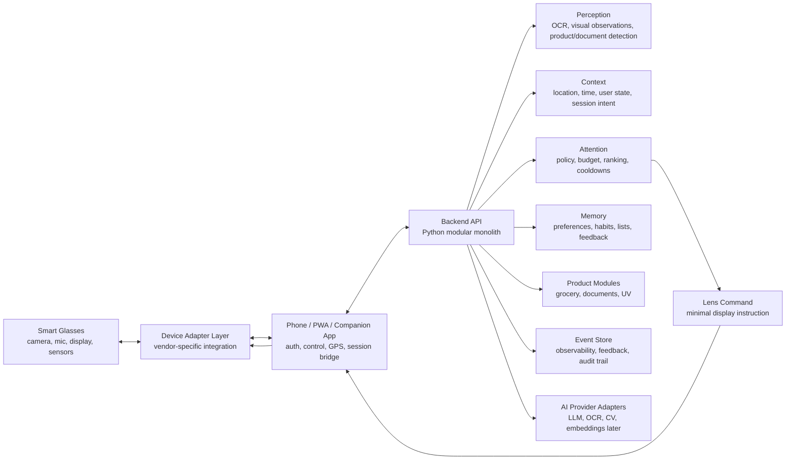
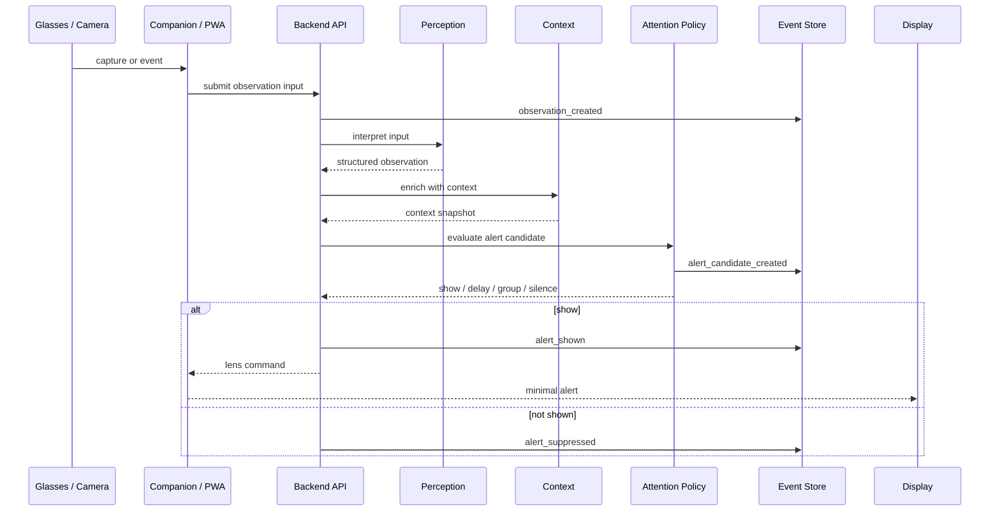

# New Era Glasses Architecture Overview

Status: Draft v1  
Date: 2026-05-23  
Owner: New Era product/engineering

## 1. Purpose

This document defines the first architectural foundation for New Era Glasses.

New Era is a contextual intelligence platform for smart glasses. The product uses existing glasses hardware as a sensor and display surface, a phone/PWA/app layer as the user control plane, and a Python backend as the intelligence, memory, orchestration, and decision layer.

The goal is not to build every possible smart-glasses feature in the MVP. The goal is to build a reusable foundation that can safely evolve into multiple contextual modules without coupling the product to one hardware vendor, one AI provider, or one interaction model.

Core product promise:

> The glasses that remember, read, and alert for you.

## 2. Current Product Thesis

New Era should not behave like a phone screen attached to the user's face. It should behave like a selective contextual assistant that knows when to stay quiet and when to interrupt.

The core loop is:

```text
observe -> understand -> contextualize -> decide -> display -> learn
```

This loop supports the first product directions:

- Grocery and memory assistant.
- Anti-trap document and contract reader.
- UV/protector and preventive reminders.
- Later: environment radar, accessibility, color assistance, measurements, and richer personal memory.

## 3. Architectural Principles

1. Use existing smart-glasses hardware before building custom hardware.
2. Keep New Era Core independent from Meta, Ray-Ban, Android XR, Xreal, or any future vendor.
3. Use Python for the MVP backend because it is strong for AI, OCR, computer vision, LLM orchestration, and rapid iteration.
4. Use Clean Architecture to keep domain logic independent from frameworks, SDKs, models, and vendors.
5. Use DDD to define clear bounded contexts: Device, Perception, Context, Attention, Memory, Modules, and Observability.
6. Prefer a modular monolith for the backend until domain boundaries and scaling profiles are proven.
7. Treat every alert decision as observable from day one.
8. Build RAG readiness now, but do not ship a heavy RAG system in the MVP.
9. Apply privacy and security by design, not as a later compliance patch.
10. Make the glasses display minimal. The app/PWA is where configuration, history, metrics, and detailed controls live.
11. Use Spec-Driven Development for implementation-driving work: specs must define contracts, acceptance criteria, security rules, performance budgets, events, and evals before code.

Related foundation documents:

- [../specs/README.md](../specs/README.md)
- [../specs/0001-platform-foundation.md](../specs/0001-platform-foundation.md)
- [../specs/0002-pwa-shell.md](../specs/0002-pwa-shell.md)
- [performance-latency.md](performance-latency.md)
- [pwa-frontend.md](pwa-frontend.md)
- [security-implementation.md](security-implementation.md)
- [ai-prompt-contracts.md](ai-prompt-contracts.md)

## 4. Target Architecture



### Runtime shape

```text
Smart glasses
  - capture visual/audio/sensor input where supported
  - display small visual commands
  - do not own product intelligence

Phone/PWA/companion
  - authenticate the user
  - provide user control, settings, and history
  - provide GPS/network bridge
  - simulate the lens during MVP
  - host a native bridge only when hardware requires it

Backend Python
  - own product intelligence
  - run Clean Architecture use cases
  - call AI/OCR/CV providers through ports
  - store memory and events
  - apply Attention Policy before any alert is displayed
```

## 5. MVP Scope

### In scope

- PWA/app experience for settings, lists, contract upload/analysis, UV reminders, and simulated lens.
- Backend Python using Clean Architecture and DDD boundaries.
- Event Schema v1.
- Attention Policy v1 with attention budget.
- Grocery list and simple product/item recognition flow.
- Anti-trap document/contract analysis flow.
- UV/protector reminder flow.
- Browser/mobile camera simulation before deep hardware integration.
- Device adapter abstraction for future Meta Ray-Ban Display or other glasses.

### Out of scope for MVP

- Custom glasses hardware.
- Heavy RAG or vector memory as a required runtime dependency.
- Real-time physical safety alerts that require sub-100ms guarantees.
- Real-time price comparison and live store inventory.
- Full visual accessibility suite.
- Advanced color correction for color blindness.
- Always-on camera recording.
- Vendor-specific product assumptions inside domain logic.

## 6. Backend Architectural Style

The backend should start as a modular monolith, not microservices.

Reason:

- The team is still discovering product boundaries.
- Use cases share user context, memory, and attention policy.
- Distributed systems would add operational cost before proving independent scaling needs.

Recommended internal structure:

```text
new_era/
  domain/
    device/
    perception/
    context/
    attention/
    memory/
    modules/
      grocery/
      documents/
      uv_health/
    observability/

  application/
    use_cases/
      analyze_document.py
      evaluate_alert_candidate.py
      process_observation.py
      update_attention_feedback.py
      update_shopping_list.py

  ports/
    ai_provider.py
    ocr_engine.py
    vision_detector.py
    device_gateway.py
    event_store.py
    memory_store.py
    weather_provider.py
    notification_gateway.py

  infrastructure/
    api/
    database/
    ai/
    ocr/
    vision/
    device_adapters/
    observability/
```

The `domain` layer must not import SDKs, HTTP clients, AI libraries, database ORMs, or vendor-specific device code.

## 7. Bounded Contexts

### Device

Owns device capability abstractions.

Responsibilities:

- Represent supported device capabilities.
- Normalize input/output from different glasses.
- Convert New Era lens commands into vendor-specific display calls.
- Keep Meta/Ray-Ban-specific code outside the core.

Important ports:

- `CameraAdapter`
- `DisplayAdapter`
- `VoiceAdapter`
- `GestureAdapter`
- `DeviceSessionGateway`

### Perception

Transforms raw input into structured observations.

Examples:

- text detected
- document detected
- product candidate detected
- grocery item detected
- sky/UV context requested

Perception should produce observations, not user-facing alerts.

### Context

Determines why an observation matters now.

Inputs:

- location
- time
- user mode
- shopping session
- document session
- preferences
- weather/UV data
- historical behavior

### Attention

The most important product boundary.

It decides whether a candidate alert should be shown now, grouped, delayed, silenced, or escalated.

Attention owns:

- attention mode
- attention budget
- per-category limits
- cooldowns
- priority ranking
- feedback adjustment
- explanation of why an alert appeared

### Memory

Stores user-controlled memory.

Examples:

- recurring grocery items
- preferred alert categories
- dismissed alert patterns
- document analysis history
- privacy settings
- health/reminder preferences

Memory must be explicit, inspectable, and deletable.

### Modules

Modules implement product-specific use cases, but they do not bypass Attention Policy.

MVP modules:

- Grocery
- Anti-trap Documents
- UV and Health Reminders

Future modules:

- Environment Radar
- Color Accessibility
- Measurements
- Routine Assistant

### Observability

Owns product, technical, and AI observability events.

This is not optional analytics. It is the feedback infrastructure that lets the product improve without guessing.

## 8. Core Flow



## 9. Attention Policy V1

Attention Policy v1 should be deterministic and simple. It does not require machine learning.

Inputs:

- `alert_type`
- `module`
- `priority`
- `confidence`
- `attention_mode`
- `context_type`
- `recent_alert_count`
- `category_budget`
- `cooldown_state`
- `user_feedback_profile`

Outputs:

- `show_now`
- `group`
- `delay`
- `silence`
- `request_confirmation`

Initial modes:

```text
Essential
  - only critical and important alerts
  - strict budget for insights

Balanced
  - important alerts plus useful contextual suggestions
  - default mode

Proactive
  - more tips, comparisons, and contextual insights
  - still budgeted to avoid spam
```

Initial rule:

> Positive feedback increases priority inside the user's attention budget. It must not remove rate limits.

Example budget:

```text
Critical safety: outside regular budget, but still logged and explainable.
Documents: low volume, high relevance.
Grocery: budget per store visit/session.
UV/health: cooldown-based.
Tips/insights: strict hourly budget.
```

## 10. Event Schema V1

The event schema should be closed in its core fields and extensible in metadata.

Stable core fields:

```json
{
  "event_id": "evt_...",
  "event_type": "alert_shown",
  "event_version": 1,
  "correlation_id": "corr_...",
  "trace_id": "trace_...",
  "user_id": "user_...",
  "session_id": "session_...",
  "module": "grocery",
  "policy_version": "attention_v1",
  "model_version": "vision_v1",
  "created_at": "2026-05-23T00:00:00Z",
  "metadata": {}
}
```

Minimum event types:

```text
observation_created
alert_candidate_created
alert_shown
alert_suppressed
alert_viewed
alert_dismissed
alert_feedback_given
attention_budget_exceeded
user_setting_changed
document_analyzed
shopping_item_detected
```

Why this matters:

- It explains why an alert appeared.
- It lets the team measure usefulness and annoyance.
- It enables future personalization safely.
- It prevents guessing after users complain about too many or too few alerts.

Event metadata rules:

- do not store raw document text in generic event metadata.
- do not store raw camera frames in event metadata.
- use IDs that point to controlled sensitive artifacts when needed.
- store policy/model versions whenever an AI or attention decision is involved.
- include correlation IDs so one user flow can be traced across device, app, backend, and AI calls.

## 11. RAG Readiness

RAG should not be a heavy MVP dependency. However, the architecture should include retrieval ports now.

Ports:

- `MemoryRetriever`
- `KnowledgeRetriever`
- `DocumentRetriever`
- `ProductRetriever`

MVP implementation:

- SQL queries.
- simple keyword search.
- document chunks stored without vector ranking.
- basic user memory retrieval.

Future implementation:

- embeddings.
- pgvector or equivalent vector search.
- reranking.
- personal semantic memory.
- contract/document similarity.
- product knowledge retrieval.

The application layer should depend on retriever interfaces, not on vector database code.

## 12. Lens Command Contract

The backend should not return UI components directly. It should return device-neutral lens commands.

Example:

```json
{
  "command_id": "cmd_...",
  "command_type": "show_alert",
  "priority": "medium",
  "title": "Missing item",
  "body": "You still need eggs.",
  "duration_ms": 5000,
  "interaction": {
    "can_dismiss": true,
    "can_mark_useful": true
  },
  "metadata": {
    "module": "grocery",
    "alert_id": "alert_..."
  }
}
```

Why this matters:

- PWA simulation, mobile app, and smart glasses can all consume the same command.
- device adapters remain thin.
- the backend owns product decision, not device-specific UI.

## 13. Data and Storage Strategy

Recommended MVP storage:

- PostgreSQL as source of truth.
- Object storage for uploaded document images/PDFs when needed.
- Event tables or event log for observability events.
- Redis only if needed for short-lived sessions, rate limits, and cooldowns.

Avoid early:

- multiple databases for separate modules.
- event sourcing as the primary domain persistence model.
- complex streaming infrastructure before event volume justifies it.

Data classes:

```text
User data
  - account, settings, consent, preferences

Memory data
  - lists, recurring items, useful/irrelevant feedback patterns

Operational data
  - sessions, alerts, decisions, budgets

Sensitive data
  - documents, location, camera-derived inputs

Observability data
  - technical events, product events, AI events
```

## 14. Reliability, Async Work, and Idempotency

Some flows are short and synchronous. Others should be treated as jobs.

Synchronous candidates:

- read user settings.
- update attention mode.
- show a simple reminder.
- evaluate an already available alert candidate.

Async/job candidates:

- document OCR and analysis.
- large image processing.
- LLM calls with retries.
- embedding generation in future RAG.
- batch feedback aggregation.

Required foundations:

- each long-running request must have a `job_id`.
- user actions that can be retried must include an `idempotency_key`.
- external AI/OCR/CV calls must have timeouts and retry policies.
- failed jobs should be visible in app/PWA, not silently lost.
- event writing should be resilient; if the event store fails, user-critical flows should degrade gracefully and log recovery work.

Cheap now, expensive later:

- version API contracts.
- version event contracts.
- version policy configs.
- version model/prompt configs.
- keep retries outside domain logic.

## 15. AI Governance and Product Safety

AI outputs should be treated as recommendations, not absolute truth.

Anti-trap document reader rules:

- show the original relevant excerpt when possible.
- explain why the excerpt matters.
- show confidence and uncertainty.
- avoid "sign" or "do not sign" as final legal advice.
- use wording such as "this clause deserves attention" or "consider reviewing this before signing."

Health/UV reminder rules:

- provide preventive reminders.
- avoid diagnosis.
- avoid medical claims outside trusted sources and user-provided settings.

AI decision metadata:

- model name/version.
- prompt/template version.
- provider.
- latency.
- cost when available.
- confidence or quality score when available.
- source references or excerpt IDs when applicable.

## 16. Privacy and Security Foundation

Security is mandatory, but privacy must also be visible as product UX.

Required foundations:

- encryption in transit
- encryption at rest
- user-controlled memory deletion
- module-level consent
- private mode
- minimum necessary capture
- no always-on recording by default
- explicit document upload/analysis consent
- access logs for sensitive actions
- clear explanation: "why did I receive this alert?"

Cheap now, expensive later:

- attach consent state to every sensitive processing request.
- store `data_retention_policy` per sensitive artifact.
- classify events so analytics does not accidentally store raw sensitive content.
- keep raw camera/document data out of generic event metadata.

## 17. Device Strategy

New Era should treat every device as an adapter.

Initial adapters:

```text
BrowserSimulationAdapter
  - simulates lens UI in PWA
  - uses phone/browser camera where available

MobileCameraAdapter
  - uses phone camera as stand-in for glasses camera

MetaRayBanAdapter
  - future adapter for Meta Ray-Ban Display or supported Meta glasses
```

Adapter rule:

> Domain logic must never depend on Meta-specific APIs, display components, SDK lifecycle, or device permissions.

Risk:

- Meta APIs may be in developer preview.
- display access, publishing, country availability, and SDK behavior can change.

Mitigation:

- keep adapters replaceable.
- keep the MVP useful with PWA simulation.
- make hardware integration a replaceable delivery mechanism, not the product core.

## 18. Latency Classes

Not every feature has the same latency requirement.

```text
0-100ms
  - future physical safety alerts
  - real-time visual correction
  - should not depend on cloud

100-800ms
  - simple object/product context
  - shopping list cues
  - session state updates

1-10s
  - document analysis
  - contract risk summaries
  - LLM reasoning
  - richer explanations
```

MVP should avoid promising sub-100ms safety behavior unless the chosen hardware and local runtime can guarantee it.

## 19. Degraded Modes

The product should remain understandable when some capability fails.

Examples:

```text
No glasses connected
  - PWA/app runs in simulation mode.

No camera permission
  - document upload and manual list flows still work.

Backend unavailable
  - app shows cached lists/settings and avoids pretending analysis is live.

AI provider timeout
  - job remains pending or fails clearly with retry.

Event store unavailable
  - critical user flow can continue, but recovery logging is required.

Unsupported hardware region
  - device adapter reports capability limits and falls back to simulation.
```

Why this matters:

- the MVP can be tested without perfect hardware.
- users understand what is happening.
- support/debugging becomes easier.

## 20. Testing Strategy

Minimum tests worth designing early:

- unit tests for Attention Policy budget and cooldown rules.
- contract tests for Device Adapter interfaces.
- contract tests for Event Schema v1.
- use case tests for grocery, document, and UV flows.
- privacy tests that prevent raw sensitive data from entering event metadata.
- regression tests for prompt/model output parsing.
- integration tests for async job retry/idempotency behavior.

This is not heavy QA. These are the tests that protect the expensive architectural decisions.

## 21. Metrics

Metrics should live in the app/PWA and internal dashboards, not in the glasses display.

### Utility

- useful feedback rate
- alerts saved
- alerts acted upon
- grocery session completion
- document risks reviewed
- reminder completion rate

### Annoyance

- dismiss rate
- dismiss within 3 seconds
- alerts per hour
- attention budget exceeded
- category disabled
- user switched to quieter mode

### Cost

- cost per document analysis
- cost per grocery session
- cost per active user/day
- LLM tokens per module
- OCR/CV processing cost
- provider error and retry cost

### Reliability

- end-to-end latency per flow
- device adapter failure rate
- AI provider timeout rate
- event ingestion failure rate
- alert delivery success rate

## 22. Technical Debt to Avoid Cheaply Now

| Risk | Cheap prevention now | Expensive later if ignored |
| --- | --- | --- |
| Vendor lock-in to Meta | Device adapter interfaces | Rewriting core when hardware changes |
| Alert spam | Central Attention Policy | Each module invents its own notification rules |
| Unexplainable AI behavior | Event schema with model/policy versions | Cannot debug why alerts appeared |
| RAG rewrite | Retriever ports | Refactoring use cases around vector search later |
| Privacy leakage in analytics | Redacted event metadata and data classification | Compliance/security retrofit |
| AI provider lock-in | AI provider ports | Rewriting prompts and clients across modules |
| Cost explosion | Track cost per flow from day one | Discovering unit economics too late |
| Fragile MVP demo | Browser simulation adapter | Blocking product validation on hardware availability |
| Mixed product logic and UI | Lens command abstraction | Hard to support glasses, PWA, and app together |
| Schema drift | Version event and command contracts | Breaking old clients and historical analytics |
| Long AI tasks blocking UX | Job IDs and async worker boundary | Rebuilding slow flows after users feel latency |
| Duplicate actions after retry | Idempotency keys | Double processing documents, alerts, or billing events |
| Legal/health overclaiming | AI governance rules | Trust, compliance, and liability problems |

## 23. Architecture Decisions to Capture as ADRs

Recommended ADRs:

```text
0001-use-existing-smart-glasses-before-custom-hardware.md
0002-python-modular-monolith-clean-architecture-ddd.md
0003-pwa-first-with-native-bridge-fallback.md
0004-device-adapter-contract.md
0005-event-schema-v1-from-day-one.md
0006-attention-policy-v1-and-attention-budget.md
0007-rag-ready-but-not-rag-heavy-mvp.md
0008-lens-command-contract.md
0009-ai-governance-and-safe-output-rules.md
```

## 24. Validation Plan

### Phase 1: Product simulation

- PWA simulates lens alerts.
- User creates shopping list.
- User uploads/scans document.
- User configures attention mode.
- Backend records event flow.

Success:

- user understands the value without hardware.
- alerts can be explained from event history.
- attention budget prevents noisy sessions.

### Phase 2: Phone camera prototype

- Phone camera acts as glasses input.
- Backend processes selected images/observations.
- PWA displays simulated lens overlay.

Success:

- grocery and document flows work with real camera input.
- latency and cost are measurable.

### Phase 3: Device adapter prototype

- Integrate one real smart-glasses platform if available.
- Keep the same backend/domain contracts.
- Replace only the adapter/display path.

Success:

- no domain rewrite required.
- device-specific failures are isolated.

## 25. Open Questions

1. Which first user segment should own the MVP narrative: forgetful shoppers, contract risk users, or preventive health users?
2. Which hardware platform is realistic for first physical integration in our region?
3. How much of the experience must work offline?
4. What is the acceptable cost per active user/day?
5. What document categories are allowed in the first anti-trap reader?
6. What data retention defaults should be used for uploaded contracts and images?
7. What is the minimum viable feedback UI: useful, not useful, too much, show more like this?
8. What is the first acceptable hardware dependency: none, phone camera, Meta developer preview, or another device?
9. What flows must be available in Portuguese first?

## 26. Architecture Summary

New Era should begin as a modular, observable, privacy-aware intelligence platform.

The glasses are not the product core. The core is the decision engine that understands context, respects attention, and learns from feedback.

The initial architecture should optimize for:

- fast product validation
- reusable domain boundaries
- safe AI evolution
- vendor-independent device support
- measurable usefulness
- low annoyance
- controlled cost

The main architectural bet is:

> Build the intelligence and attention system as the durable asset. Treat hardware, models, and UI surfaces as replaceable adapters.
