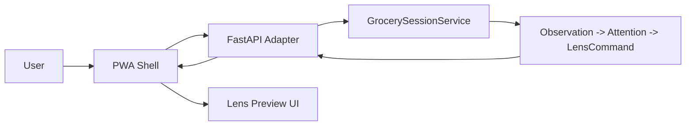

# PWA Frontend Architecture

Status: Draft v1  
Date: 2026-05-23  
Related runtime: [../../src/new_era/infrastructure/http/app.py](../../src/new_era/infrastructure/http/app.py)

## 1. Purpose

This document defines the frontend and PWA architecture for New Era's first web companion experience.

The current PWA is not a marketing site. It is the first usable simulation surface for:

- sending observations into the platform
- receiving lens-ready commands back from the backend
- visualizing the difference between observation, decision, and display
- validating product flow before hardware integration

## 2. Product Role of the PWA

The PWA has three jobs in the MVP:

1. Simulate the companion app and lens preview.
2. Provide a safe surface to validate flows without glasses hardware.
3. Become the first operational UI layer that will later host more modules.

The PWA is not the product core. It is a presentation and control surface over backend decisions.

## 3. Frontend Principles

1. Keep the lens preview minimal and legible.
2. Keep product logic in the backend.
3. Keep the frontend honest about state: idle, loading, delivered, suppressed, or error.
4. Prefer small, structured API responses over client-side inference.
5. Do not let the PWA become a second attention engine.
6. Support degraded use when backend or device capabilities are unavailable.
7. Treat privacy and safety as visible UI concerns, not hidden implementation details.

## 4. Current PWA Scope

Implemented now:

- root page served by FastAPI
- manifest
- service worker shell
- grocery simulation form
- lens preview surface
- decision summary panel
- API integration with `POST /api/simulations/grocery/missing-item`
- session/history panel backed by server-side user sessions
- user-scoped session trace reads with module/step/event filters

Not implemented yet:

- user authentication
- production document upload consent/deletion flow
- offline mutation queue
- install education
- push notifications
- background sync

## 5. Runtime Architecture



Frontend responsibilities:

- collect structured input
- show request state
- show backend outcome
- preview the lens card
- show lightweight telemetry summary
- register the service worker

Backend responsibilities:

- interpret input
- decide whether to show
- create the lens command
- produce observable events
- enforce safety and policy rules

## 6. File Structure

Current PWA files:

```text
src/new_era/infrastructure/http/static/
  index.html
  styles.css
  app.js
  manifest.webmanifest
  service-worker.js
```

Recommended growth path:

```text
static/
  index.html
  styles.css
  app.js
  manifest.webmanifest
  service-worker.js
  modules/
    grocery.js
    documents.js
  ui/
    lens-preview.js
    network-status.js
```

Keep frontend code modular as features expand, but do not introduce a heavy frontend framework unless it clearly earns its keep.

## 7. UI State Model

The PWA should treat each flow as an explicit state machine.

Minimum states:

```text
idle
loading
delivered
suppressed
error
```

Why this matters:

- the frontend remains predictable
- users understand why no alert appeared
- tests stay simple
- the backend remains the authority on decisions

## 8. API Contract Rules

Frontend requests must be structured and minimal.

Example request:

```json
{
  "user_id": "demo-user",
  "session_id": "demo-session",
  "item_name": "eggs",
  "confidence": 0.88,
  "mode": "balanced",
  "recent_category_count": 0
}
```

Example response:

```json
{
  "outcome": "delivered",
  "candidate_created": true,
  "command": {
    "title": "Missing eggs",
    "body": "You still need eggs."
  },
  "event_count": 4,
  "delivered_commands_count": 1
}
```

Frontend rules:

- never invent outcome meaning client-side
- never derive display permission client-side
- treat `command: null` as valid when outcome is suppressed
- treat unexpected response shapes as errors

## 9. Security and Privacy Requirements

The PWA is not trusted for critical decisions.

Frontend requirements:

- do not embed secrets
- do not persist sensitive document content in local storage by default
- do not cache API POST bodies in the service worker
- avoid storing raw personal data in debug panels
- clearly separate demo/simulated identifiers from future real user identifiers
- handle backend errors without exposing sensitive stack traces

MVP privacy stance:

- the current grocery simulation uses demo identifiers
- no auth tokens are stored yet
- no personal document flow is exposed in the current PWA

Before document flows are added:

- define upload and retention UI explicitly
- define consent states
- define delete flows
- define safe error rendering for OCR/analysis failures

## 10. Service Worker Strategy

Current strategy:

- cache only the read-only shell assets: `/`, `/static/styles.css`, `/static/app.js`, and `/manifest.webmanifest`
- serve shell assets from cache when available
- use network-first navigation with fallback to cached `/` only for non-sensitive app routes
- bypass service worker caching for `/api/*`, uploads, result/detail routes, and every non-GET request
- never cache responses marked as `Cache-Control: no-store`, `Cache-Control: private`, `X-New-Era-Sensitive: true`, or responses that vary on sensitive headers such as `Authorization` or `Cookie`
- delete old cache versions during service worker activation

Intentional limitations:

- no offline mutation queue
- no stale write replay
- no background sync
- no API caching
- no upload caching
- no caching of analysis results, job results, or user-specific read models
- no caching of document detail views or any document-sensitive response payloads

Why:

- keeps offline behavior read-only and understandable
- avoids dangerous offline assumptions early
- avoids storing sensitive request data or result payloads in cache
- prevents old caches from surviving service worker upgrades

Safe fallback rules:

- navigations to regular shell routes can fall back to cached `/` if the network is unavailable
- navigations to sensitive paths such as analysis detail and job/result routes stay network-only
- shell asset refreshes are cached only when the response is public and non-sensitive
- background fetches for shell assets are same-origin only

Document-sensitive routes and payloads:

- `/document-analyses/{analysis_id}/view` stays network-only even though it renders the shell
- `/api/document-analyses/*`, `/api/document-artifacts/*`, `/api/jobs/*`, and `/api/uploads/*` stay network-only
- future document responses should emit `X-New-Era-Sensitive: true` or `Cache-Control: no-store` when they must not be cached anywhere in the browser stack

Future additions should be deliberate:

- richer offline read-only shell routes with explicit allowlists
- controlled document draft storage
- versioned cache invalidation for expanded shell assets

## 11. Performance Guidance

PWA performance priorities:

- fast first render
- low JS complexity
- small static bundle
- no framework hydration cost yet
- clear loading feedback during API calls

Practical rules:

- keep `app.js` lean
- avoid extra libraries until needed
- keep the lens preview simple
- avoid chatty polling
- use structured, compact responses from the backend

## 12. Accessibility and Interaction

Minimum standards for the PWA:

- keyboard-accessible form controls
- visible loading and error states
- clear contrast in the lens preview and control panel
- `aria-live` for network status and changing results where useful
- stable layout on mobile and desktop

The lens preview is representational. It must remain readable even when the real glasses UI later becomes more spatial.

## 13. Growth Path

Recommended order:

1. Stabilize grocery simulation shell.
2. Add document simulation module to the same shell.
3. Replace demo user IDs with real authentication.
4. Split static modules when the JS surface grows.
5. Reassess whether a frontend framework is justified.

## 14. Risks to Avoid

- moving business logic into the frontend
- making suppression look like failure
- hiding backend uncertainty
- storing sensitive data casually in cache or browser storage
- growing the PWA into a second backend
- introducing a framework before the interaction model is stable

## 15. Decision Summary

The PWA should remain a thin, honest, useful control surface.

The durable rule is:

> The frontend shows what happened. The backend decides what is allowed, what is useful, and what reaches the lens.
