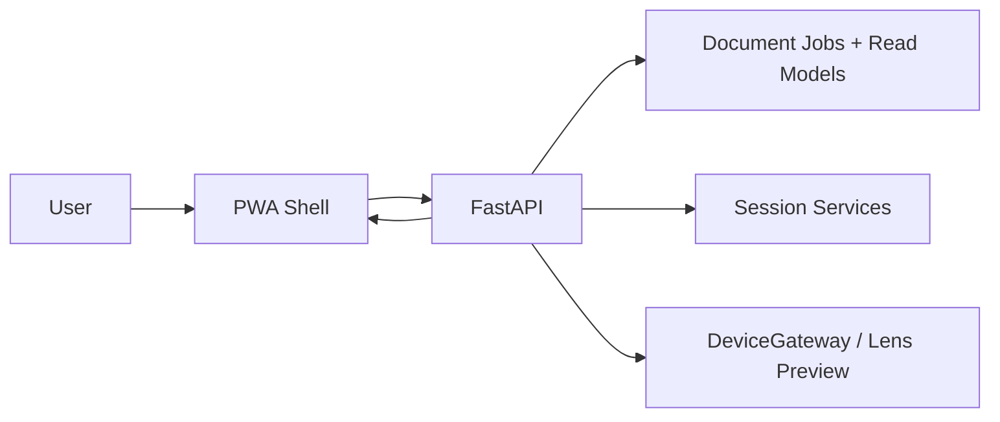

# PWA Frontend Architecture

Status: Active reference  
Last updated: 2026-05-25  
Related runtime: [../../src/new_era/infrastructure/http/app.py](../../src/new_era/infrastructure/http/app.py)

## Purpose

Describe the PWA as it exists today, what has progressed, and what remains before it can be treated as a production companion app.

## Product Role

The PWA is the current companion surface for:

- grocery simulation
- document upload and document job follow-up
- lens preview
- session history and result access
- feedback submission

It is not the product core. It renders backend decisions and exposes controls around them.

## Current Frontend Scope

Implemented:

- root shell served by FastAPI
- auth bootstrap through `GET /api/auth/session`
- cookie-session login/logout endpoints for the same-origin companion
- browser write flows that can derive current user server-side without body-level `user_id`
- manifest and service worker
- grocery simulation form
- document upload and text submission flow
- lens preview and result panels
- job polling and automatic result opening
- session job/history panels
- friendly rendering of `PolicyRejection`
- `blocked_reason` support from the `/jobs` read model
- read-only offline shell behavior for sensitive flows

Still missing:

- production-grade authentication UX
- install education and lifecycle UX polish
- offline mutation queue
- push notifications
- background sync
- browser E2E coverage

## Current Runtime Shape



## Frontend Rules

The PWA must remain thin:

- it does not decide alert delivery
- it does not decide quota outcomes
- it does not infer job completion from time
- it does not fake offline success for sensitive writes

Backend truth comes from:

- simulation outcomes
- job status endpoints
- analysis result endpoints
- read models like `blocked_reason`

## Offline and Caching Posture

Current service-worker posture:

- cache read-only shell assets
- do not cache `POST` mutations
- do not cache document uploads or sensitive result payloads
- fall back to cached shell only for safe navigation routes

This is intentionally conservative. The current offline story is:

```text
offline shell: yes
offline document work: no
offline mutation replay: no
```

## What Progressed Recently

The document flow is no longer just a simulation stub. It now includes:

- upload acceptance and policy rejection states
- session-level job blocking messages
- refresh-safe blocked-state recovery through `/jobs`
- result persistence after artifact expiration
- safer offline handling for document-sensitive paths

## What Still Needs Work

### Ready for the next pass

- better mobile ergonomics and install UX
- browser automation coverage
- clearer empty/loading states for multi-session usage

Current auth-aware bootstrapping now follows [auth-boundary.md](auth-boundary.md):

- `GET /api/auth/session` as the PWA authority for authenticated state
- same-origin backend-managed session cookie for the browser companion
- explicit local-password login UI and logout controls in the shell
- expiry/relogin behavior that returns the shell to an auth gate on `401` or session timeout
- `current-user` session routes for history and jobs
- no browser token storage as the main MVP contract

Still missing on top of that:

- provider-backed login beyond local-first credentials
- browser automation coverage for the auth gate and relogin path

### Not ready yet

- any client-side persistence of sensitive document content
- any claim that uploads or analyses work offline
- any frontend-side policy engine

## Files

Current PWA files:

```text
src/new_era/infrastructure/http/static/
  index.html
  styles.css
  app.js
  manifest.webmanifest
  service-worker.js
```

## Related Specs

- [../specs/0002-pwa-shell.md](../specs/0002-pwa-shell.md)
- [../specs/0003-document-mvp-hardening.md](../specs/0003-document-mvp-hardening.md)
