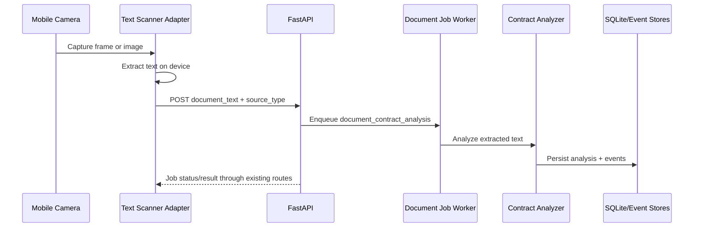

# Mobile Text Scanner Capture

Status: Planned  
Spec ID: SPEC-0005  
Owner: Platform / Capture  
Date: 2026-05-26

Coordination plan:

- [../architecture/mobile-text-scanner-execution-plan.md](../architecture/mobile-text-scanner-execution-plan.md)
- [../architecture/mobile-text-scanner-auth-transport.md](../architecture/mobile-text-scanner-auth-transport.md)

## 1. Objective

Add a low-risk mobile text scanner path that improves document capture quality without moving contract intelligence into the client.

The scanner should extract text on the device, then submit that text into the existing document analysis flow. The backend remains the authority for jobs, policy, ownership, history, feedback, and contract-risk analysis.

This is intentionally smaller than a full camera intelligence layer. It is a capture improvement, not a new decision engine.

## 2. Product Thesis

The current MVP already supports:

- text entry
- image upload
- OCR-backed image analysis
- async document jobs
- trace/history
- feedback

The OCR image path works, but quality can degrade when the image is noisy, compressed, blurry, or poorly framed. A mobile scanner can improve the input by using on-device OCR before the backend receives the document.

Target behavior:

```text
mobile scanner -> extracted text -> existing document job -> analysis -> history -> feedback
```

## 3. First Adapter Choice

Use Google ML Kit Text Recognition v2 as the first OCR adapter for the POC.

Reason:

- fits Android and mobile-portable strategy better than an Apple-only first step
- runs on device
- keeps capture/OCR close to the camera
- leaves the backend vendor-neutral

Apple Vision can remain a later optional adapter. The backend contract must not assume ML Kit-specific field names or confidence semantics.

Important distinction:

- ML Kit Text Recognition v2 is the OCR engine. It reads text from images/video and returns full recognized text plus structured blocks, lines, elements, bounding boxes, corner points, rotation data, language, and confidence.
- ML Kit Document Scanner is a capture/scanning UI for physical documents. It can return JPEG/PDF outputs, but it is not the contract-analysis engine and should be treated as an optional capture-quality layer.

POC decision:

- start with Text Recognition v2
- add Document Scanner only if the capture UX or image quality needs it

## 3.1 ML Kit Runtime Fit

Android Text Recognition v2:

- requires Android API level 23 or above
- can use a bundled model or an unbundled Google Play services model
- bundled model increases app size but is available immediately
- unbundled model is smaller but may need download before first use
- Latin script recognition is the first target for this MVP because the current contract examples are Latin-script text

Recommended POC packaging:

- use the bundled Latin model for the first demo to avoid first-run model download uncertainty
- revisit unbundled packaging when app size matters more than demo reliability

Android capture options:

- simple camera/photo input plus Text Recognition v2
- CameraX frame analysis plus Text Recognition v2 for live scanning
- optional Document Scanner flow when we want a more guided document capture UX

Recommended POC capture:

- start with one still image or selected camera capture
- process it with Text Recognition v2
- submit extracted text to the existing backend job endpoint

Recommended MVP-good capture:

- use Document Scanner or CameraX if capture quality is the bottleneck
- then run Text Recognition v2 on the captured JPEG/image
- let the user review extracted text before submit

## 4. Non-Goals

Do not build these in the first pass:

- custom OCR
- legal analysis on the device
- native glasses integration
- multi-page document scanner
- advanced perspective correction
- production mobile auth system
- offline mutation queue
- vendor-specific backend branches such as `if source_adapter == "mlkit"`

## 5. Minimal POC Contract

The POC should avoid backend API expansion if possible.

Use the existing endpoint:

```text
POST /api/jobs/documents/contract-analysis
```

Minimal JSON payload:

```json
{
  "session_id": "demo-documents-session",
  "artifact_label": "mobile-text-scan.txt",
  "source_type": "mobile_text_scanner",
  "idempotency_key": "scan_<stable_client_id>",
  "document_text": "Extracted contract text from the mobile scanner...",
  "mode": "balanced",
  "recent_category_count": 0,
  "observation_id": "obs_<client_generated_id>",
  "correlation_id": "corr_<client_generated_id>",
  "trace_id": "trace_<client_generated_id>"
}
```

Field rules:

- `document_text` is the scanner output and must be at least the current backend minimum length, currently 20 characters.
- `document_text` must be normalized before submit: trim leading/trailing whitespace, normalize line endings, collapse repeated blank lines, and remove control characters that are not meaningful document text.
- `document_text` must be bounded in the POC. The client should reject or ask the user to split/review text above 50,000 characters instead of silently posting unbounded OCR output.
- `source_type` must be adapter-neutral; use `mobile_text_scanner`, not `mlkit`.
- `confidence` must not be populated from ML Kit recognition confidence in the POC. If the existing backend default is used, treat it as existing backend behavior, not as scanner quality.
- `idempotency_key` must be stable for retries of the same capture.
- the backend derives `user_id` from the authenticated session.

This path intentionally does not upload the source image in the first POC.

Auth/transport precondition:

- The existing endpoint is not an anonymous native API. It resolves identity through the current-user/auth boundary.
- Cookie-authenticated browser writes require same-origin intent and must remain protected for the PWA.
- Native mobile submission must use a documented POC auth/transport choice before ML Kit POST testing begins.
- The POC must not weaken the PWA cookie/current-user/same-origin behavior.
- The POC still uses the existing endpoint; do not add a scanner-specific endpoint unless the contract-only POC proves the current route is insufficient.

## 6. Optional MVP Contract With Image Evidence

If the MVP needs image retention or debugging evidence, use the existing multipart upload endpoint:

```text
POST /api/uploads/documents/contract-analysis
```

Form fields:

```text
artifact=<captured image file>
session_id=demo-documents-session
document_text=<scanner extracted text>
mode=balanced
recent_category_count=0
idempotency_key=scan_<stable_client_id>
observation_id=obs_<client_generated_id>
correlation_id=corr_<client_generated_id>
trace_id=trace_<client_generated_id>
```

This keeps the current artifact lifecycle, retention, and job history behavior.

Trade-off:

- JSON text-only path is simpler and faster.
- multipart image-plus-text path is better for auditability and debugging.

Decision:

- start with JSON text-only POC
- graduate to multipart only if scanner quality needs visual evidence or demo review
- keep scanner confidence out of backend `confidence` until a separate scanner-quality schema is approved

## 7. Backend Behavior

The backend should treat scanner text like any other trusted input candidate, but not as a final truth.

Required behavior:

- authenticate through the current-user boundary
- enforce same-origin browser rules for cookie-authenticated PWA writes
- require an approved and documented POC transport/auth path before native mobile writes
- apply existing ownership checks
- enqueue the existing document analysis job
- preserve `source_type` in job and analysis metadata
- write normal trace/history events
- allow feedback on the resulting analysis

The backend must not:

- run legal/risk logic based on scanner metadata in the client
- assume ML Kit-specific confidence ranges forever
- treat ML Kit recognition confidence as backend analysis confidence in the POC
- skip policy, quota, idempotency, or retention rules
- persist raw scanner text in generic event metadata

## 8. Client Behavior

The scanner client owns only capture and extraction.

POC client responsibilities:

- open camera or image source
- run on-device text recognition
- build a normalized and bounded text payload from the recognized text
- optionally keep block/line metadata locally for UX/debug, but do not require it in the backend POC
- let the user approve or retry the extracted text
- submit extracted text to the backend only through the documented POC auth/transport path
- surface backend job status and result

MVP-good client responsibilities:

- show capture states:
  - scanning
  - text found
  - review extracted text
  - sending
  - queued
- allow manual text correction before submit
- retry safely with the same `idempotency_key`

Do not put contract-risk labels in the scanner UI before backend analysis returns.

ML Kit extraction shape:

- use the full recognized text as `document_text`
- normalize line endings and whitespace before submit
- enforce the POC `document_text` upper bound before submit
- use line/block count only for local quality hints in the POC
- do not send raw bounding boxes to the backend unless a later review feature needs visual highlighting
- do not map ML Kit confidence directly to backend `confidence`
- do not map ML Kit language/confidence fields directly into backend policy decisions

Minimal client-side quality gate:

- reject empty text
- warn when extracted text is below the backend minimum length
- block or require explicit review for text above the POC maximum length
- show a review/edit screen before submit
- let the user retry capture instead of sending obviously broken OCR

## 9. Architecture Flow



## 10. Implementation Plan

### Phase 1: Contract-only POC

Backend:

- no new endpoint
- verify `source_type="mobile_text_scanner"` works through existing job flow
- add a focused test for scanner text payload if needed
- preserve current current-user and same-origin browser behavior
- do not treat scanner confidence as backend `confidence`

Client/harness:

- create a small local script or mobile prototype that posts scanner-like text payloads
- compare results against plain text and image OCR

Exit criteria:

- job queues and succeeds
- analysis result persists
- trace/history shows scanner-originated job
- no PWA or legacy `/api/users/{user_id}` dependency is introduced
- no scanner-specific endpoint is added
- scanner text payload is normalized and bounded

### Phase 2: Auth/Transport POC Decision

Coordinator/Auth:

- document how the native or harness client will authenticate for POC submission
- distinguish temporary POC transport from production mobile auth
- keep cookie/current-user/same-origin browser behavior intact for the PWA
- confirm the POC still targets `POST /api/jobs/documents/contract-analysis`

Exit criteria:

- Agent 2 has a documented submission path before native POST testing
- no ownership check is bypassed
- no production mobile auth claim is made from a temporary POC path

### Phase 3: ML Kit POC

Client:

- integrate ML Kit Text Recognition v2 in a minimal Android or cross-platform shell
- extract text from one-page contract photos
- normalize and bound extracted text
- use bundled Latin script recognition for first-run demo reliability
- submit the existing JSON payload
- do not send ML Kit confidence as backend `confidence`

Backend:

- accept the existing payload unchanged
- record source as `mobile_text_scanner`

Exit criteria:

- at least three contract photos tested:
  - clean
  - medium quality
  - poor quality
- scanner text path performs closer to text input than raw image OCR

### Phase 4: MVP-Good Scanner

Client:

- add user review before submit
- add simple retry and correction path
- decide whether CameraX live analysis or ML Kit Document Scanner gives the better capture experience
- optionally send image plus extracted text through multipart upload

Backend:

- add structured scanner metadata only if the POC proves it is needed
- keep analyzer and policy logic server-side

Exit criteria:

- demo flow is stable
- result quality is better than raw image upload
- fallback path is documented

## 11. Validation Plan

Required backend validation:

```powershell
$env:PYTHONPATH='src'; python -m pytest tests/unit/test_http_app.py
```

Required MVP validation after integration:

```powershell
python .\tools\validate_local.py --with-e2e
```

Suggested scanner comparison set:

- text pasted directly into `/api/jobs/documents/contract-analysis`
- same document as image upload through current OCR
- same document through scanner-extracted text

Success signal:

- scanner-extracted text should produce findings and confidence closer to text input than raw OCR image upload.

## 12. Risks And Guardrails

Risk: scanner output becomes a second source of truth.  
Guardrail: backend remains the only contract-analysis authority.

Risk: source-specific behavior leaks into backend.  
Guardrail: use neutral `source_type` and avoid ML Kit conditionals.

Risk: mobile work expands into a full native app too early.  
Guardrail: POC only submits text to the existing job endpoint.

Risk: confidence values are not comparable across OCR vendors.  
Guardrail: do not map ML Kit confidence into backend `confidence` in the POC; add structured scanner-quality metadata later only if needed.

Risk: native mobile auth weakens the validated PWA boundary.  
Guardrail: decide and document the POC auth/transport path before native submission, and keep current-user plus same-origin browser protections intact.

Risk: scanner OCR posts unbounded or poorly normalized text.  
Guardrail: normalize `document_text`, enforce the backend minimum, and cap POC submissions at 50,000 characters with user review instead of silent truncation.

Risk: raw sensitive text leaks into events.  
Guardrail: keep current event metadata redaction rules and avoid storing raw scanner text in trace events.

## 13. Current Execution State

Completed in the repository:

- backend job contract accepts `source_type="mobile_text_scanner"` through the existing document job route
- scanner text is bounded by the shared 50,000 character request limit
- backend tests cover scanner payload success, idempotency, invalid text, and source metadata preservation
- local scanner comparison harness compares direct text, generated image OCR, and simulated scanner text
- POC auth/transport boundary is documented separately
- isolated Android/Kotlin scaffold exists at `apps/mobile-text-scanner/`
- Android scaffold uses ML Kit Text Recognition v2 bundled Latin model and submits the existing JSON payload

Deferred:

- clean/medium/poor real photo comparison set
- production native auth contract
- Gradle/Android SDK build validation in this workspace
- real device validation against a running local backend

## 14. Open Decisions

- First client shell: native Android, React Native, Flutter, or a thin local harness.
- Whether scanner image evidence is required for the first demo.
- Whether scanner metadata deserves a first-class schema after the POC.
- Whether Android uses bundled Text Recognition v2 for reliability or unbundled Google Play services models for smaller app size.
- Whether MVP-good capture uses CameraX live frame analysis, the ML Kit Document Scanner UI, or both.
