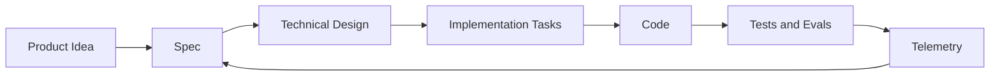

# Spec-Driven Development

Status: Draft v1  
Date: 2026-05-23  
Scope: New Era delivery process

## Purpose

New Era will use Spec-Driven Development (SDD) to keep product, architecture, AI behavior, performance, and security aligned before implementation starts.

The goal is not to create paperwork. The goal is to make every important implementation decision traceable:

```text
problem -> spec -> design -> tasks -> implementation -> tests -> telemetry
```

## Why SDD Fits New Era

New Era has more risk than a normal CRUD product:

- AI can hallucinate or overclaim.
- Alerts can annoy the user.
- Device APIs may change.
- Latency changes user trust.
- Camera, location, documents, and user memory are sensitive.
- Future RAG and personalization can create hidden coupling if not planned.

SDD forces each capability to define its contract before code:

- what the feature does
- what it must not do
- what data it may process
- what events it must emit
- what latency budget applies
- what security/privacy controls are required
- how success will be measured

## Delivery Flow



## Spec Types

### Product Spec

Defines user problem, user journey, non-goals, acceptance criteria, and metrics.

Use for:

- grocery assistant
- anti-trap document reader
- UV/protector reminders
- future accessibility modules

### Architecture Spec

Defines boundaries, ports, adapters, data contracts, sync/async behavior, failure modes, and migration path.

Use for:

- device adapter contract
- event schema
- attention policy
- memory/retrieval layer
- AI provider abstraction

### AI/Prompt Spec

Defines model role, objective, inputs, output schema, refusal/fallback behavior, evaluation cases, and safety limits.

Use for:

- contract risk extraction
- document summarization
- product recognition explanation
- alert wording generation

### Security/Privacy Spec

Defines data classification, consent, retention, redaction, audit events, abuse cases, and access control.

Use for:

- document upload
- location-based context
- user memory
- camera-derived observations

### Performance Spec

Defines latency budget, cost budget, payload size, throughput assumptions, caching, async boundaries, and degraded behavior.

Use for:

- document analysis jobs
- event ingestion
- alert decision path
- device/app/backend communication

## Spec Lifecycle

```text
Draft
  - idea is being shaped.

Ready for Design
  - problem, non-goals, constraints, and acceptance criteria are clear.

Ready for Implementation
  - interfaces, events, tests, security, and performance budgets are defined.

Implemented
  - code exists and passes required checks.

Observed
  - telemetry confirms real behavior.

Revised
  - feedback or telemetry changed the spec.
```

## Required Sections for Serious Specs

Every implementation-driving spec must include:

1. Objective
2. User story or system story
3. In scope
4. Out of scope
5. Functional requirements
6. Non-functional requirements
7. Data and privacy classification
8. Security requirements
9. Performance and latency budget
10. Events and observability
11. Failure modes
12. Acceptance criteria
13. Test/eval plan
14. Open questions

## Prompt/AI Contract Rules

AI behavior must be specified as a contract, not as a loose instruction.

Each AI prompt or model workflow must define:

- objective
- target model/provider class
- trusted inputs
- untrusted inputs
- output schema
- source citation or excerpt requirements when applicable
- confidence/uncertainty behavior
- refusal/fallback behavior
- safety wording limits
- eval cases
- version identifier

Example version format:

```text
document_risk_prompt_v1
grocery_item_classifier_v1
attention_policy_v1
```

## Traceability Rules

Each implemented capability should be traceable through:

```text
SPEC-ID -> requirement ID -> code module -> tests/evals -> events/metrics
```

Example:

```text
SPEC-0001 -> REQ-ATT-001 -> attention_policy.py -> test_attention_budget.py -> alert_suppressed
```

## Defaults

Default architecture style:

- Python modular monolith.
- Clean Architecture.
- DDD bounded contexts.
- device/vendor adapters outside the domain.
- async jobs for long AI/OCR/CV workflows.
- event schema from day one.

Default product stance:

- minimal glasses display.
- app/PWA owns controls and metrics.
- user controls attention intensity.
- privacy must be visible, not only internal.

Default performance stance:

- critical display path must be fast and deterministic.
- expensive AI work runs async.
- no raw continuous video upload in the MVP.
- track cost per flow from the beginning.

Default security stance:

- never trust the client.
- classify sensitive data.
- store minimum necessary data.
- encrypt data in transit and at rest.
- keep sensitive raw content out of generic telemetry.
